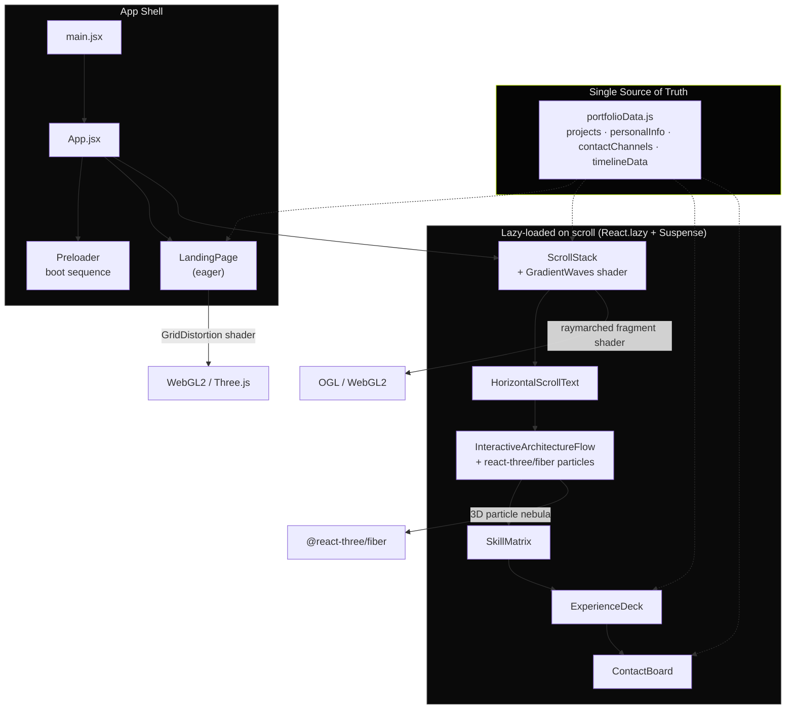

<div align="center">

# Mohit — AI / Backend Engineer

**Interactive portfolio** · RAG pipelines · agentic workflows · distributed backend systems

[**Live Site**](#) &nbsp;·&nbsp; [**Resume**](/resume.pdf) &nbsp;·&nbsp; [**Contact**](#contact)


</div>

<br/>

A one-page portfolio site built as an engineering demo as much as a resume: a custom WebGL distortion shader in the hero, a raymarched fluid shader behind the project cards, a live 3D particle field behind a clickable architecture diagram, and a 1.48 MB → 206 KB bundle cut through route-level code splitting. Everything is driven from one data file, so content updates never touch component code.

## Contents

- [Architecture](#architecture)
- [Sections](#sections)
- [Performance](#performance)
- [Tech stack](#tech-stack)
- [Getting started](#getting-started)
- [Project structure](#project-structure)
- [Customization](#customization)
- [Contact](#contact)

<br/>

## Architecture



The dotted lines are the part that matters most for maintainability: `portfolioData.js` is the only place content lives. `LandingPage`'s social icons and `ContactBoard`'s contact list both read the same `contactChannels` array — there's no second copy of an email or handle anywhere in the codebase to drift out of sync.

<br/>

## Sections

| Section | Technique |
|---|---|
| **Hero** | Cursor-reactive WebGL grid distortion (`GridDistortion.jsx`, raw Three.js + custom GLSL) |
| **Featured Projects** | Scroll-linked 3D card stack (`useScroll` + `useTransform`) over a raymarched shader background (`GradientWaves.jsx`, OGL) |
| **Tech Stack Reveal** | Three-layer clip-path scan effect driven by `useMotionTemplate`, synced to scroll position |
| **Interactive Architecture** | Clickable, expandable system-design diagram floating over a rotating 3D particle field (`@react-three/fiber`) |
| **Skill Matrix** | Terminal-styled animated pipeline with a pointer-tracked radial spotlight |
| **Experience Timeline** | Accordion where expanded-row height is computed from array length — no hardcoded pixel values |
| **Contact Board** | Spring-animated flex accordion, sourced from the same `contactChannels` data as the header |

<br/>

## Performance

Route-level code splitting via `React.lazy` + manual Vite/Rolldown chunking. Real output from `npm run build`:

| Chunk | Size (min) | Gzip | Loads when |
|---|---:|---:|---|
| `index` (app shell) | 206.6 KB | 66.2 KB | immediately |
| `motion` (Framer Motion) | 141.1 KB | 46.4 KB | immediately |
| `gsap` | 112.8 KB | 44.4 KB | on scroll to reveal sections |
| `three` (Three.js + fiber) | 884.1 KB | 235.3 KB | on scroll to architecture section |
| `ogl` | 44.2 KB | 12.9 KB | on scroll to projects |
| `react-icons` | 30.0 KB | 13.0 KB | immediately (header icons) |

**Result:** first paint only pays for the app shell and motion library — not the 884 KB Three.js dependency, which most visitors won't even trigger if they don't scroll that far.

```
Before splitting:  1 chunk,  1.48 MB
After splitting:   9 chunks, 206 KB initial
Lint:              0 errors, 0 warnings (React Compiler strict mode)
```

<br/>

## Tech stack

| Layer | Choices |
|---|---|
| Framework | React 19, Vite 8 (Rolldown) |
| Styling | Tailwind CSS 4 |
| Animation | Framer Motion, GSAP + ScrollTrigger |
| 3D / Shaders | Three.js, `@react-three/fiber`, OGL (hand-written GLSL) |
| Icons | lucide-react, react-icons |
| Tooling | ESLint 10 (flat config), React Compiler (Babel) |

<br/>

## Getting started

```bash
npm install       # install dependencies
npm run dev       # start dev server
npm run lint      # lint (zero warnings expected)
npm run build     # production build
npm run preview   # preview the build locally
```

Requires Node.js 18+.

<br/>

## Project structure

```
src/
├── components/
│   ├── LandingPage.jsx                 hero, nav, WebGL distortion
│   ├── GridDistortion.jsx              Three.js shader: cursor-reactive warp
│   ├── ScrollStack.jsx                 scroll-linked project cards
│   ├── GradientWaves.jsx               OGL raymarched shader background
│   ├── HorizontalScrollText.jsx        clip-path scroll reveal
│   ├── InteractiveArchitectureFlow.jsx clickable diagram + 3D particles
│   ├── SkillMatrix.jsx                 terminal-style skill pipeline
│   ├── ExperienceDeck.jsx              accordion timeline
│   ├── ContactBoard.jsx                animated contact panel
│   ├── ScrollReveal.jsx                GSAP word-by-word reveal
│   └── Preloader.jsx                   boot-sequence loader
├── data/
│   └── portfolioData.js                single source of truth
├── App.jsx                             composition + lazy boundaries
└── main.jsx
```

<br/>

## Customization

All content lives in `src/data/portfolioData.js`:

1. `personalInfo` — name, tagline, links, resume path
2. `projects` — your project cards
3. `contactChannels` — auto-derived from `personalInfo.links`, no separate edit needed
4. `timelineData` — education / experience entries

Then swap the placeholder images in `public/` (`1.jpg`–`4.jpg`, `a.jpg`, `home.jpg`) and `resume.pdf`. No component file needs to change for a content update.

<br/>

## Contact

<a id="contact"></a>

youremail@example.com &nbsp;·&nbsp; [LinkedIn](https://linkedin.com/in/yourusername) &nbsp;·&nbsp; [GitHub](https://github.com/yourusername) &nbsp;·&nbsp; [LeetCode](https://leetcode.com/yourusername)